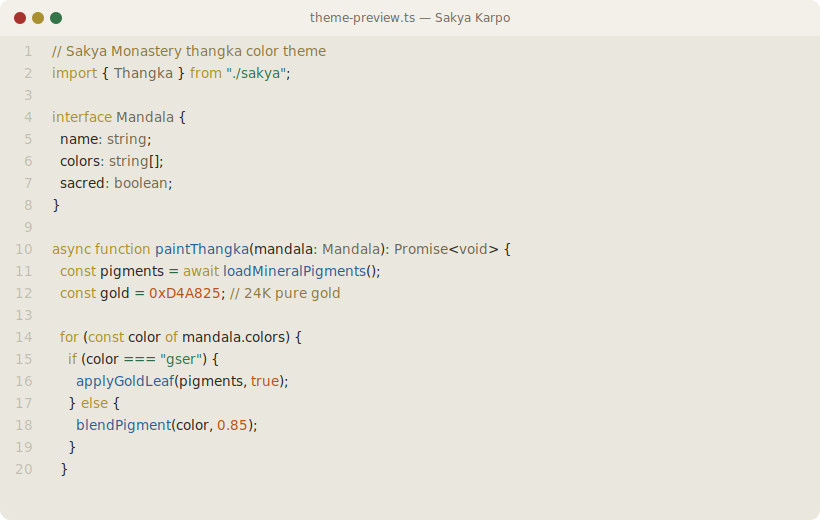

# Sakya Theme

Color theme inspired by [Sakya Monastery](https://en.wikipedia.org/wiki/Sakya_Monastery) thangka paintings and Tibetan Buddhist art.

Two variants named after the Bodhisattvas on Sakya Monastery's tri-color walls:

- **Dorje** (dark) — Vajrapani's blue-black, power and protection
- **Karpo** (light) — Avalokiteshvara's white, compassion and purity

## Preview

### Dorje (dark)


### Karpo (light)



## Color Logic

The theme's colors are not arbitrary — every color traces back to Tibetan Buddhist iconography and traditional thangka mineral pigments.

### Semantic Mapping

```
Code Element          Color              Source                    Buddhist Meaning
─────────────────────────────────────────────────────────────────────────────────────
keyword, control flow │ Gser (gold)      │ 24K gold powder         │ Most sacred — gold is
                      │ #D2B450          │                         │ applied last in thangka
                      │                  │                         │ painting, crowning the work
──────────────────────┼──────────────────┼─────────────────────────┼──────────────────────────
function, method      │ Ngonpo (blue)    │ Azurite / 石青           │ Akshobhya Buddha
                      │ #5B8AB8          │ Cu₃(CO₃)₂(OH)₂         │ Wisdom of Dharmadhatu
──────────────────────┼──────────────────┼─────────────────────────┼──────────────────────────
string                │ Ljangkhu (green) │ Malachite / 孔雀石       │ Amoghasiddhi Buddha
                      │ #4A8B5E          │ Cu₂CO₃(OH)₂            │ All-accomplishing wisdom
──────────────────────┼──────────────────┼─────────────────────────┼──────────────────────────
type, interface       │ Karpo (white)    │ Calcium carbonate / 白垩 │ Vairochana Buddha
                      │ #E8DCC8          │ CaCO₃                  │ Mirror-like wisdom
──────────────────────┼──────────────────┼─────────────────────────┼──────────────────────────
comment               │ Serpo (yellow)   │ Orpiment / 雌黄          │ Ratnasambhava Buddha
                      │ #A09058          │ As₂S₃                  │ Wisdom of equality —
                      │                  │                         │ teaching all beings equally
──────────────────────┼──────────────────┼─────────────────────────┼──────────────────────────
error                 │ Mtshal (red)     │ Cinnabar / 朱砂          │ Amitabha Buddha
                      │ #CC3B30          │ HgS                    │ Discriminating wisdom
──────────────────────┼──────────────────┼─────────────────────────┼──────────────────────────
number, constant      │ Likhri (orange)  │ Minium / 铅丹            │ Lead tetraoxide pigment
                      │ #D85A1E          │ Pb₃O₄                  │ used for fixed patterns
──────────────────────┼──────────────────┼─────────────────────────┼──────────────────────────
operator              │ Spangma (green)  │ Malachite / 石绿         │ Copper carbonate green
                      │ #3E7E56          │                         │ cool mineral undertone
──────────────────────┼──────────────────┼─────────────────────────┼──────────────────────────
link, property        │ Mutsmen (blue)   │ Lapis lazuli / 青金石     │ Natural ultramarine
                      │ #2E4878          │                         │ deeper than synthetic
──────────────────────┼──────────────────┼─────────────────────────┼──────────────────────────
tag                   │ Tsingkha (blue)  │ Indigo / 靛蓝            │ Plant-derived deep blue
                      │ #2B3560          │                         │
──────────────────────┼──────────────────┼─────────────────────────┼──────────────────────────
decorator             │ Metok (pink)     │ Lac dye + chalk / 虫胶   │ Lotus flower pink
                      │ #C88090          │                         │
```

### Background Layer

The dark theme (Dorje) backgrounds use the blue-black hue of **Vajrapani** — one of the three Bodhisattvas represented on Sakya Monastery walls. The light theme (Karpo) uses the warm white of **Avalokiteshvara**.

### Why Gold for Keywords?

In thangka painting, gold is the **last pigment applied** and the **most sacred**. It marks halos, mantras, and divine ornaments. In code, keywords (`import`, `const`, `function`, `if`, `for`) are the structural skeleton — the most important navigational markers. Gold appears sparingly but unmistakably.

## Install

### VS Code

Download the latest `.vsix` from [Releases](https://github.com/XuanLee-HEALER/sakya-theme/releases), then:

```
Ctrl+Shift+P → Extensions: Install from VSIX...
```

Select **Sakya Dorje** (dark) or **Sakya Karpo** (light) from Color Theme.

### iTerm2

1. Open iTerm2 → Preferences → Profiles → Colors
2. Click **Color Presets...** → **Import...**
3. Select `iterm2/sakya-dorje.itermcolors` or `iterm2/sakya-karpo.itermcolors`

### Starship

```sh
cp starship/starship.toml ~/.config/starship.toml
```

## License

MIT
