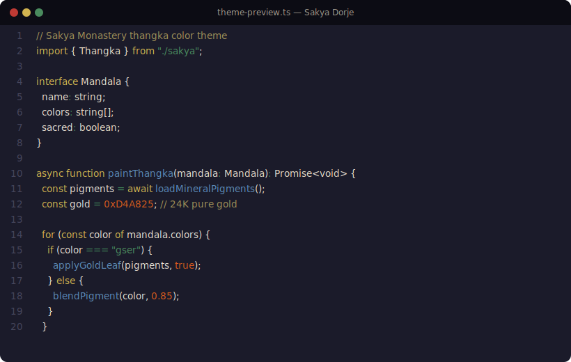

# Sakya Theme

Color theme inspired by [Sakya Monastery](https://en.wikipedia.org/wiki/Sakya_Monastery) thangka paintings and Tibetan Buddhist art. Like a black thangka (Nag-thang) — gold lines of enlightened form emerging from the void.

Named **Dorje** after Vajrapani (金刚手菩萨), whose blue-black hue forms one of the three sacred stripes on Sakya Monastery walls.

## Preview



## Color Logic

Every color traces back to Tibetan Buddhist iconography and traditional thangka mineral pigments, calibrated against spectrophotometer measurements from [Natural Pigments](https://www.naturalpigments.com/rublev-colours-oils-munsell-notations).

| Code Element | Color | Pigment | Munsell | Buddhist Meaning |
|---|---|---|---|---|
| **keyword** | Gser `#D2B450` | 24K gold powder | — | Most sacred, applied last |
| **function** | Ngonpo `#5B8AB8` | Azurite | ~6.25PB | Akshobhya · Dharmadhatu wisdom |
| **string** | Ljangkhu `#527559` | Malachite | 1.5G 4.5/3.7 | Amoghasiddhi · All-accomplishing |
| **type** | Karpo `#EFE2BE` | Lead white | 3.75Y 9/2.5 | Vairochana · Mirror-like wisdom |
| **comment** | Serpo `#A09058` | Orpiment | 4.4Y 8.7/8.9* | Ratnasambhava · Equality |
| **error** | Mtshal `#BB4441` | Cinnabar (HgS) | 6.25R 4.5/11 | Amitabha · Discriminating |
| **number** | Likhri `#E85600` | Minium (Pb₃O₄) | 0.5YR 5.5/15.5 | Fixed patterns |
| **operator** | Spangma `#527559` | Malachite | 1.5G 4.5/3.7 | Copper carbonate |
| **property** | Dri-med `#C4BCAE` | — | — | Secondary text |
| **decorator** | Metok `#C88090` | Lac dye + chalk | — | Lotus flower pink |

*\* Orpiment measures #FAD95D at full brightness; dimmed for use as comment color.*

### Why Gold for Keywords?

In thangka painting, gold is the **last pigment applied** and the **most sacred**. In code, keywords are the structural skeleton. Gold appears sparingly but unmistakably.

## Install

### VS Code

Download the `.vsix` from [Releases](https://github.com/XuanLee-HEALER/sakya-theme/releases), then:

```
Ctrl+Shift+P → Extensions: Install from VSIX...
```

Select **Sakya Dorje** from Color Theme.

### iTerm2

1. iTerm2 → Preferences → Profiles → Colors
2. **Color Presets...** → **Import...**
3. Select `iterm2/sakya-dorje.itermcolors`

### Starship

```sh
cp starship/starship.toml ~/.config/starship.toml
```

## License

MIT
